# 🔄 Claude Documentation Merge Flow

**Document Version**: 1.0.0  
**Last Updated**: 2025-08-03  
**System**: Dual Claude Implementation v2.7.0

---

## 📋 Overview

The **Dual Claude System** automatically merges two separate CLAUDE.md files into a unified CLAUDE-MASTER.md that Claude Code CLI reads. This enables both global system instructions (CES) and project-specific instructions to coexist seamlessly.

### System Architecture


---

## 🏗️ Component Architecture

### Core Components

#### 1. **Merge Script** (`scripts/merge-claude-docs.sh`)
- **Purpose**: Shell script that performs the actual file merging
- **Features**: Backup creation, validation, error handling, metadata generation
- **Execution**: Called by TypeScript utilities and direct CLI commands

#### 2. **ClaudeDocManager** (`src/utils/ClaudeDocManager.ts`)
- **Purpose**: Enterprise-grade TypeScript utility for document management
- **Features**: File watching, caching, validation, backup/restore
- **Pattern**: Singleton for consistent state management

#### 3. **Documentation Commands** (`src/cli/DocumentationCommands.ts`)
- **Purpose**: CLI interface for documentation operations
- **Features**: Interactive commands, colored output, auto-regeneration
- **Integration**: Integrated into main CLIManager for seamless UX

#### 4. **Project Template** (`templates/PROJECT-CLAUDE.md.template`)
- **Purpose**: Standardized template for project-specific instructions
- **Features**: Variable substitution, structured sections, best practices
- **Usage**: Automatically created when project CLAUDE.md is missing

---

## 🔄 Merge Process Flow

### Phase 1: Pre-Merge Validation


**Validation Steps:**
1. Check script permissions and dependencies
2. Verify working directory structure
3. Validate source file existence and readability
4. Check destination directory permissions
5. Verify backup directory availability

### Phase 2: Backup Creation

```mermaid
flowchart LR
    A[🔍 Check Existing<br/>CLAUDE-MASTER.md] --> B{File Exists?}
    B -->|Yes| C[📦 Create Backup<br/>.backups/]
    B -->|No| D[💭 Skip Backup]
    C --> E[✅ Backup Created<br/>Timestamped]
    D --> F[🔄 Proceed to Merge]
    E --> F
```



**Backup Strategy:**
- **Location**: `.backups/` directory in project root
- **Naming**: `CLAUDE-MASTER.md.backup.{timestamp}`
- **Retention**: Configurable (default: keep last 10 backups)
- **Format**: Exact copy with metadata preservation

### Phase 3: Content Assembly

```mermaid
graph TD
    A[🌐 Global CLAUDE.md] --> E[📝 Content Assembly]
    B[📁 Project CLAUDE.md] --> E
    C[📊 Metadata Generation] --> E
    D[🔧 Template Variables] --> E
    
    E --> F[📋 Generate Header<br/>Auto-generated notice]
    F --> G[🌍 Add Global Section<br/>CES system instructions]
    G --> H[📁 Add Project Section<br/>Project-specific instructions]
    H --> I[📊 Add Metadata Footer<br/>Generation info & stats]
    I --> J[💾 Write CLAUDE-MASTER.md]
    
    style E fill:#fff3e0
    style J fill:#e8f5e8
```



**Content Structure:**
```markdown
# CLAUDE-MASTER.md
# Auto-generation header with timestamp
# DO NOT EDIT notice

## 🌐 GLOBAL SYSTEM INSTRUCTIONS (CES)
# Source: ~/.claude/CLAUDE.md
[Global CES content]

## 📁 PROJECT-SPECIFIC INSTRUCTIONS  
# Source: ./CLAUDE.md
[Project-specific content]

## 📋 MERGE METADATA
# Generation info, source status, configuration
```

### Phase 4: Post-Merge Operations


---

## 🛠️ Integration Points

### CLI Integration

The merge process integrates with multiple CLI entry points:

#### 1. **Direct CLI Commands**
```bash
# Direct documentation commands
npm run dev -- docs show          # Display merged documentation
npm run dev -- docs regenerate    # Trigger merge process
npm run dev -- docs validate      # Validate documentation setup
npm run dev -- docs edit          # Edit project CLAUDE.md + auto-regen
npm run dev -- docs debug         # Debug merge system
```

#### 2. **Session Integration**
```bash
# Session commands that trigger merge
npm run dev -- start-session      # Auto-merge during session start
npm run dev -- checkpoint-session # Merge before checkpoint creation
```

#### 3. **Auto-Integration Script**
```bash
# Integration script calls merge
./scripts/integrate.sh             # Includes merge as part of setup
```

### File Watching Integration

```mermaid
graph LR
    A[📁 Global CLAUDE.md<br/>~/.claude/CLAUDE.md] --> D[👁️ File Watcher<br/>chokidar]
    B[📁 Project CLAUDE.md<br/>./CLAUDE.md] --> D
    C[📋 CLAUDE-MASTER.md<br/>./.claude/CLAUDE-MASTER.md] --> D
    
    D --> E{File Changed?}
    E -->|Yes| F[🔄 Auto-Regenerate<br/>merge-claude-docs.sh]
    E -->|No| G[💤 Continue Watching]
    F --> H[📢 Notify User<br/>Colored console output]
    G --> D
    H --> D
```



**Watching Features:**
- **Real-time**: Changes detected immediately
- **Debouncing**: Prevents excessive regeneration
- **Smart Filtering**: Only watches relevant CLAUDE.md files
- **Error Handling**: Graceful handling of file system errors

---

## 📊 Advanced Features

### Conflict Resolution

When both global and project files contain conflicting instructions:

```mermaid
flowchart TD
    A[🔍 Detect Conflicts] --> B{Conflict Type?}
    B -->|Section Overlap| C[📝 Merge with Headers<br/>Global → Project]
    B -->|Variable Conflict| D[⚠️ Project Takes Precedence<br/>with Warning]
    B -->|Format Conflict| E[🔧 Standardize Format<br/>Follow Template]
    
    C --> F[📋 Generate Merged Content]
    D --> F
    E --> F
    F --> G[✅ Write Final Document]
```



### Performance Optimization

#### Caching Strategy
```typescript
interface CacheEntry {
    filePath: string;
    lastModified: Date;
    checksum: string;
    content?: string;
    metadata: ClaudeDocMetadata;
}
```

#### Smart Regeneration
- **File Hash Comparison**: Only regenerate if source files changed
- **Incremental Updates**: Update only changed sections when possible
- **Memory Caching**: Cache frequently accessed content
- **Background Processing**: Non-blocking regeneration for large files

### Error Handling & Recovery

```mermaid
graph TD
    A[🚨 Error Detected] --> B{Error Type?}
    B -->|File Not Found| C[📄 Create Template<br/>Use default content]
    B -->|Permission Error| D[🔐 Fix Permissions<br/>Suggest commands]
    B -->|Syntax Error| E[🔧 Validate & Fix<br/>Report issues]
    B -->|System Error| F[🔄 Automatic Retry<br/>3 attempts max]
    
    C --> G[📋 Continue Process]
    D --> H[⚠️ User Intervention<br/>Required]
    E --> I[📝 Generate Report<br/>Show problems]
    F --> J{Retry Success?}
    J -->|Yes| G
    J -->|No| H
```



---

## 🧪 Testing Strategy

### Test Coverage Matrix

| Component | Unit Tests | Integration Tests | E2E Tests |
|-----------|------------|-------------------|-----------|
| **merge-claude-docs.sh** | ✅ Function tests | ✅ File I/O tests | ✅ CLI workflow |
| **ClaudeDocManager.ts** | ✅ All methods | ✅ Cache behavior | ✅ Session integration |
| **DocumentationCommands.ts** | ✅ Command parsing | ✅ Script execution | ✅ User interaction |
| **File Watching** | ✅ Event handling | ✅ Debouncing | ✅ Auto-regeneration |

### Test Scenarios

#### 1. **Basic Merge Operations**
```bash
# Test script: scripts/test-dual-claude.sh
npm run test:dual-claude:basic
```

#### 2. **Edge Cases**
- Missing source files
- Empty files
- Large files (>1MB)
- Binary content detection
- Permission issues
- Concurrent access

#### 3. **Performance Tests**
- Large project with 100+ CLAUDE instructions
- Rapid file changes (stress testing)
- Memory usage under continuous watching
- Cold start vs warm cache performance

---

## 🔧 Configuration Options

### Environment Variables

```bash
# Merge behavior configuration
CES_CLAUDE_MERGE_ENABLED=true              # Enable/disable auto-merge
CES_CLAUDE_MERGE_BACKUP_COUNT=10           # Number of backups to keep
CES_CLAUDE_MERGE_WATCH_ENABLED=true        # Enable file watching
CES_CLAUDE_MERGE_WATCH_DEBOUNCE=1000       # Debounce delay (ms)

# Path configuration
CES_CLAUDE_GLOBAL_PATH=~/.claude/CLAUDE.md # Global CLAUDE.md location
CES_CLAUDE_PROJECT_PATH=./CLAUDE.md        # Project CLAUDE.md location
CES_CLAUDE_MASTER_PATH=./.claude/CLAUDE-MASTER.md # Output location

# Advanced options
CES_CLAUDE_MERGE_VERBOSE=false             # Verbose logging
CES_CLAUDE_MERGE_DRY_RUN=false            # Dry run mode
CES_CLAUDE_MERGE_FORCE=false              # Force overwrite
CES_CLAUDE_MERGE_VALIDATE=true            # Pre-merge validation
```

### Runtime Configuration

```typescript
interface MergeConfiguration {
    enabled: boolean;
    backupCount: number;
    watchEnabled: boolean;
    debounceDelay: number;
    verboseLogging: boolean;
    validationEnabled: boolean;
    paths: {
        global: string;
        project: string;
        master: string;
        backup: string;
    };
}
```

---

## 📈 Monitoring & Analytics

### Merge Metrics

```typescript
interface MergeMetrics {
    totalMerges: number;
    successRate: number;
    averageMergeTime: number;
    lastMergeTime: Date;
    sourcesStatus: {
        globalSize: number;
        projectSize: number;
        masterSize: number;
    };
    errorCount: number;
    warningCount: number;
}
```

### Performance Monitoring

```mermaid
graph LR
    A[📊 Merge Execution] --> B[⏱️ Time Tracking]
    A --> C[💾 Memory Usage]
    A --> D[📁 File I/O Stats]
    A --> E[🔍 Cache Hit Rate]
    
    B --> F[📈 Performance Dashboard]
    C --> F
    D --> F
    E --> F
    
    F --> G[🚨 Alert System<br/>Performance degradation]
```



---

## 🚀 Future Enhancements

### Planned Features

#### 1. **Smart Conflict Resolution**
- AI-powered conflict detection
- Automatic resolution suggestions  
- Interactive conflict resolution UI

#### 2. **Version Control Integration**
- Git hooks for automatic merging
- Branch-aware configuration
- Merge conflict prevention

#### 3. **Cloud Synchronization**
- Remote backup storage
- Multi-device synchronization
- Team collaboration features

#### 4. **Advanced Templates**
- Framework-specific templates
- Dynamic template generation
- Template marketplace

---

## 📚 Troubleshooting Guide

### Common Issues

#### Issue 1: "CLAUDE-MASTER.md not found"
```bash
# Solution
npm run dev -- docs validate     # Check system status
npm run dev -- docs regenerate   # Force regeneration
```

#### Issue 2: "Merge script failed"
```bash
# Debug steps
npm run dev -- docs debug        # Gather debug info
bash scripts/merge-claude-docs.sh --dry-run --verbose
```

#### Issue 3: "File watching not working"
```bash
# Check configuration
echo $CES_CLAUDE_MERGE_WATCH_ENABLED
npm run dev -- docs debug        # Check watcher status
```

#### Issue 4: "Permission denied"
```bash
# Fix permissions
chmod +x scripts/merge-claude-docs.sh
mkdir -p .claude .backups
chmod 755 .claude .backups
```

### Debug Commands

```bash
# Comprehensive debug
npm run dev -- docs debug

# Test merge process
bash scripts/test-dual-claude.sh

# Manual merge with verbose output
bash scripts/merge-claude-docs.sh --merge --verbose

# Validate complete setup
npm run dev -- validate --verbose
```

---

## 📋 API Reference

### ClaudeDocManager Methods

```typescript
class ClaudeDocManager {
    // Initialization
    static getInstance(): ClaudeDocManager;
    async initialize(): Promise<void>;
    
    // File operations
    async getMetadata(filePath: string): Promise<ClaudeDocMetadata | null>;
    async searchContent(pattern: string, paths?: string[]): Promise<ClaudeDocSearchResult[]>;
    
    // Backup operations
    async createBackup(filePath: string, description?: string): Promise<ClaudeDocBackupInfo | null>;
    async restoreFromBackup(backupInfo: ClaudeDocBackupInfo): Promise<boolean>;
    getBackups(filePath: string): ClaudeDocBackupInfo[];
    
    // Watching
    async startWatching(paths: string[], callback: (event: ClaudeDocWatchEvent) => void): Promise<void>;
    async stopWatching(paths?: string[]): Promise<void>;
    
    // Validation & Operations
    async validateSetup(): Promise<ClaudeDocValidation>;
    async executeMerge(options?: MergeOptions): Promise<boolean>;
    
    // Utilities
    getMetrics(): Record<string, any>;
    async cleanup(): Promise<void>;
}
```

### Merge Script Parameters

```bash
# merge-claude-docs.sh parameters
--merge                 # Execute merge operation
--dry-run              # Show what would be done without executing
--verbose              # Enable verbose output
--force                # Force overwrite without prompts
--help                 # Show usage information
--backup-count N       # Set number of backups to keep
--validate-only        # Only validate, don't merge
```

---

## 📄 Related Documentation

- **[CES Architecture Overview](docs/ARCHITECTURE-OVERVIEW.md)** - System architecture details
- **[CLI Commands Reference](docs/CLI-COMMANDS-REFERENCE.md)** - Complete CLI documentation  
- **[Testing Guide](docs/TESTING-GUIDE.md)** - Testing procedures and frameworks
- **[Troubleshooting Guide](docs/TROUBLESHOOTING-GUIDE.md)** - Problem resolution procedures

---

**Generated by**: Dual Claude System v2.7.0  
**Maintainer**: Claude Ecosystem Standard Team  
**Last Review**: 2025-08-03

*This documentation is automatically updated when the merge system evolves.*